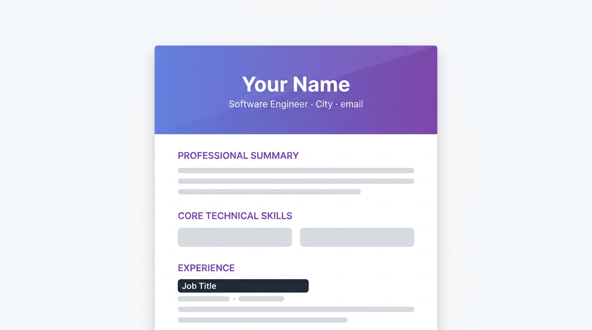

# Single-page HTML resume (gradient)

Print-friendly, single-file CV: gradient header, grouped skills, projects, experience, and education. Use **Print → Save as PDF** in the browser. **No build step** — open `index.html` in your browser.

**Maintainer:** [Arul Cornelious](https://arulcornelious.com) · [GitHub](https://github.com/Arul1998) · [LinkedIn](https://www.linkedin.com/in/arul-cornelious) · [Portfolio](https://arulcornelious.com)

Parent project: [`resume-templates`](../README.md).

---

## Preview

Layout reference (sample wireframe; not real CV content):



Vector alternative: [`preview.svg`](./preview.svg).

---

## Quick start

1. Open **`index.html`** and replace each `{{TOKEN}}` with your text (search for `{{` in your editor).
2. Optionally use **`placeholders.json`** as a checklist — the page does not load it automatically.
3. Open the file in a browser, then **Print → Save as PDF** (Chrome or Edge recommended for layout fidelity).

## Placeholder reference

| Token | Used for |
|--------|----------|
| `{{FULL_NAME}}`, `{{HEADLINE}}` | Header |
| `{{LOCATION}}`, `{{PHONE}}`, `{{EMAIL}}` | Contact line |
| `{{LINKEDIN_URL}}`, `{{PORTFOLIO_URL}}`, `{{GITHUB_URL}}` | Profile links (full `https://` URLs) |
| `{{PROFESSIONAL_SUMMARY}}` | Summary (HTML allowed, e.g. `<strong>`) |
| `{{SKILLS_*}}` | Five skill rows: Front-End, Back-End, Mobile, DevOps & Quality, AI/ML |
| `{{PROJECT_N_*}}` | Up to three projects: title, tech line, bullets |
| `{{EDU_N_*}}` | Two education entries |
| `{{JOB_N_*}}` | Four roles: title, company, dates, bullets |
| `{{CERT_N_*}}` | Six certification lines |
| `{{LANGUAGES}}`, `{{AVAILABILITY}}`, `{{RELOCATION}}` | Additional information |

## Customizing the layout

- **More roles or projects:** copy a full `.experience-item` or `.project-item` block and adjust numbering if needed.
- **Fewer sections:** remove entire `.section` blocks you do not need.
- **Colors:** in `<style>`, change `#667eea` and `#764ba2` to your palette.

## Git remote (optional)

If you maintain your own copy on GitHub, add your repository URL (replace the placeholder with your username or organization):

```bash
git remote add origin https://github.com/YOUR_USERNAME/resume-templates.git
git branch -M main
git push -u origin main
```

If `origin` already exists, use `git remote set-url origin <url>` instead of `git remote add`.
